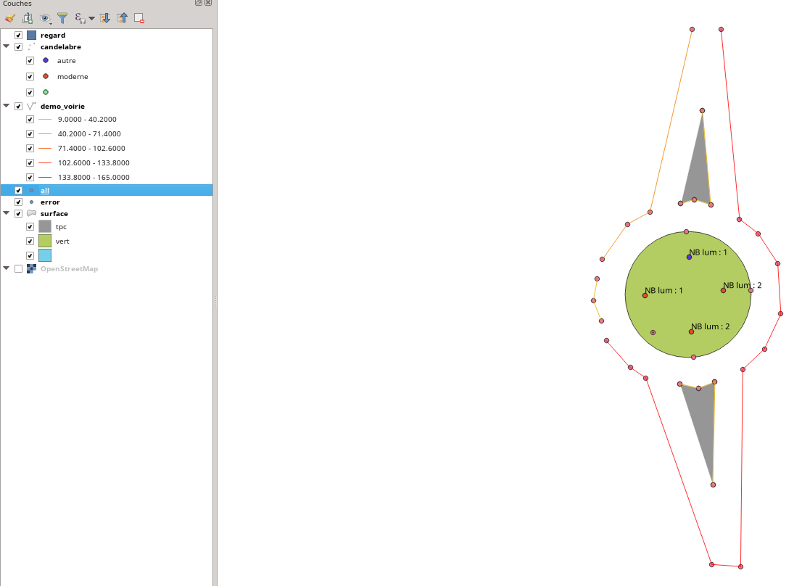

# landsurveycodesimport

[English version](#EN)
[Version Française](#FR)

## Land Survey QGIS plugin

landsurveycodesimport is a QGIS 3 plugin for importing codified topographic surveys. It consists of a codification editor and a processing in the toolbox.

## What is a codified survey?

A codified survey is a topographic survey (total station or GPS) where at each point is associated one or more codes in the fieldbook. Codification makes it possible to automatically draw objects in different layers of the drawing.

## Codification editor

The editor will allow you to perform the codification used during your survey. The geometries resulting from your processing will be in GeoPackage files that you have previously created. You can pre-fill attributes from this configuration.

The configuration file is a simple text file (in YAML format) that will be used to process your survey. You can perform as many codifications as you wish.

## Import of points

Nowadays, the plugin only reads point files in CSV format. This is often present on the devices. They must respect this layout: number,x,x,y,z,code,att1,att2 where number is the point number, x,y and z are the coordinates, code the code(s) on the point, att1,att2 and attn are the attributes that can be exported from your field book; there is no limit on the number of attributes.

The import is done by selecting the codification file and the csv file

Once the treatment is complete, you can refresh the map to admire your work.

See the [documentation](https://htmlpreview.github.io/?https://github.com/Oslandia/landsurveycodesimport/blob/master/help/en/html/index.html) for more détails

___

## Plugin QGIS de codification des levés de topographie
landsurveycodesimport est un plugin QGIS 3 permettant d'importer des levés topographique codifié. Il est composé d'un éditeur de codification et d'un traitement dans la boîte à outil.

## Qu-est qu'un levé codifié ?

Un levé codifié est un levé topographique (station totale ou GPS) où à chaque point est associé un ou plusieurs codes dans le carnet de terrain. La codification permet de dessiner automatiquement les objets dans différentes couches du dessin.

## Éditeur de codification

L'éditeur va vous permettre de réaliser la codification utilisée lors de votre relevé topographique. Les géométries résultantes de votre traitement seront dans des fichiers GeoPackage que vous aurez préalablement créé. Vous pouvez pré-remplir des attributs dès cette configuration.

Le fichier de configuration est un simple fichier texte (au format YAML) qui servira au traitement de votre levé. Vous pouvez réaliser autant de codification que vous souhaitez.

## Import des points

À ce jour, le plugin ne sait lire que les fichiers de points au format CSV. Celui-ci est souvent présent sur les appareils. Ils devront respecter cette disposition : numéro,x,y,z,code,att1,att2 où numéro est le numéro du point, x,y et z sont les coordonnées, code le(s) code(s) sur le point, att1, att2 et attn sont les attributs pouvant être exportés de votre carnet de terrain ; il n'y a pas de limite sur le nombre d'attribut.

L'import se fait en sélectionnant le fichier de codification et le fichier csv

Une fois le traitement réalisé, vous pouvez raffraîchir la carte pour admirer votre travail.

Voir la [documentation](https://htmlpreview.github.io/?https://github.com/Oslandia/landsurveycodesimport/blob/master/help/fr/html/index.html) pour plus de détails
